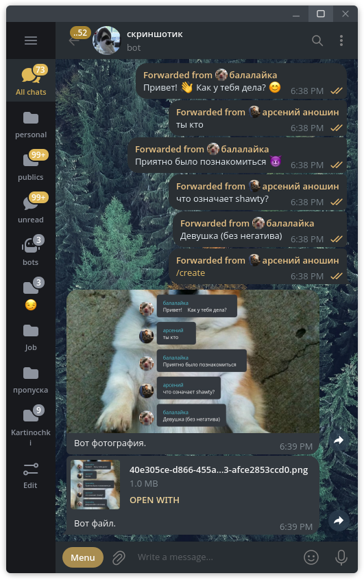

# MSGVisualizer Bot!
Этот бот присланные ему сообщения превращает в фотографию (типа скриншот)



### В ветке `bot` - код для бота
### В ветке `background` - код для фона (там flask)

Чтобы запустить, нужно создать папки `bg` и `db`, прописать в `docker-compose.yml` токен для бота, а затем
```bash
docker compose up
```
И бот будет запущен!

## Попробовать прямо сейчас можно в телеграме [@msgvisbot](https://t.me/msgvisbot)
